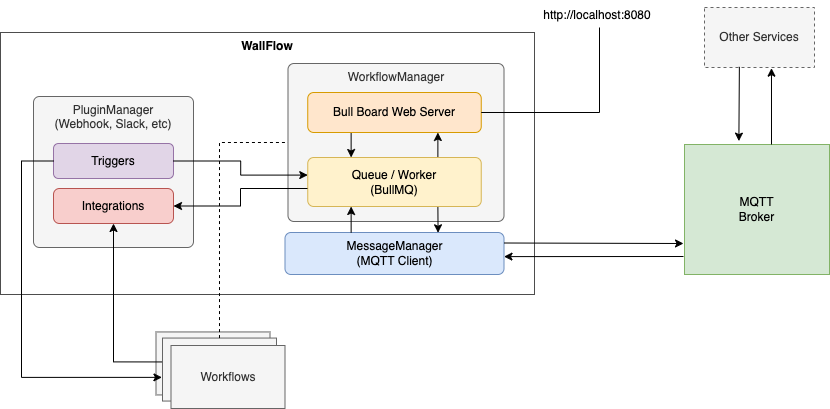

# WallFlow

A tiny, blazing fast workflow automation service for programmatically authoring, scheduling and monitoring workflows.

Powered by [BullMQ](https://github.com/taskforcesh/bullmq)

## How it works?

## Supported Plugins

- [Scheduler](./docs/plugins/Scheduler.md) - Trigger repeatable workflow using an interval or set schedule
- [SendGrid](./docs/plugins/SendGrid.md) - Send emails via [SendGrid](https://sendgrid.com)
- [Slack](./docs/plugins/Slack.md) - Triggers workflows using Slack events or to send slack messages.
- [WebHook](./docs/plugins/WebHook.md) - Trigger workflows using webhooks
- [HttpRequest](./docs/plugins/HttpRequest.md) - Trigger workflows using webhooks
